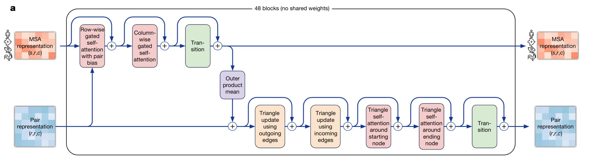

```{r setup, include=FALSE}
options(htmltools.dir.version = FALSE)
knitr::opts_chunk$set(
  fig.width=9, fig.height=3.5, fig.retina=3,
  out.width = "100%",
  cache = FALSE,
  echo = FALSE,
  message = FALSE, 
  warning = FALSE,
  hiline = TRUE
)
```

```{r xaringan-themer, include=FALSE, warning=FALSE}
library(xaringanthemer)
style_duo_accent(
  primary_color = "#1381B0",
  secondary_color = "#FF961C",
  inverse_header_color = "#FFFFFF"
)
```

```{r xaringan-tile-view, echo=FALSE}
xaringanExtra::use_tile_view()
```

```{r xaringan-logo, echo=FALSE}
xaringanExtra::use_logo(
  image_url = "figures/LOGO.png",
  width="150px"
)
```


## Sequence Determines Structure <br> Structure Determines Function


.pull-left[

>"the native conformation is determined by the totality of interatomic interactions and  hence by the amino acid sequence"

]

.pull-right[
```{r nobel, fig.align = "center", fig.cap="Nobel lecture by christian anfinsen, December 11, 1972", out.width = '40%'}


```
]

---
## Input MSA

- Search at protein DB

```{r,echo=FALSE,out.width='100%'}
url <- "https://toolkit.tuebingen.mpg.de/tools/hhblits"
knitr::include_url(url, height = "400px")
```

---
## MSA Results

Example sequence: 
GWSTELEKHREELKEFLKKEGITNVEIRIDNGRLEVRVEGGTERLKRFLEELRQKLEKKGYTVDIKIE

```{r,echo=FALSE,out.width='100%'}
url <- "https://toolkit.tuebingen.mpg.de/jobs/6366618"
knitr::include_url(url, height = "400px")
```

---

## MSA processing features

- MSA block deletion (MSA-level dropout)  
  
- Nseq sequences are randomly selected as MSA cluster centers

- Mask

- Mask Method like BERT pretraing; Self supervised feature learning


---
## Processing Input Embedding

```{r input-emb, fig.align = "center", fig.cap="Input feature embeddings", out.width = '70%'}


```


---
## Evoformer Block(Sequence Embedding)

```{r evo, fig.align = "center", fig.cap="", out.width = '70%'}



```

- Transformer Structure and self attention

- MSA representation and Pair representation

---
## Structure Module (IPA)

```{r ipa, fig.align = "center", fig.cap="", out.width = '70%'}


```


---
## Structure Module (IPA)

```{r ipa2, fig.align = "center", fig.cap="", out.width = '70%'}


```

---
## Model Training

- Recycling in training and inference

- MSA resampling at training and inference

- Self distillation

- Loss function

$$\mathcal{L}=\begin{cases}
    0.5 \mathcal{L}_{FAPE}+0.5 \mathcal{L}_{aux}+0.3\mathcal{L}_{dist}+2\mathcal{L}_{msa}+0.01 \mathcal{L}_{conf} & \text{training} \\
    \mathcal{L}_{training} + 0.01 \mathcal{L}_{exp resolved} +1.0 \mathcal{L}_{viol} & \text{fine-tuning}
\end{cases}$$

---
## Applicationsas

- Multimer prediction
- Protein small molecule interactions prediction
- Microprotein
    
```{r,fig.align = "center", out.wideth="10%", fig.height=16}
library(r3dmol)
library(bio3d)

viewer_spec = m_viewer_spec(
  cartoonQuality = 10,
  lowerZoomLimit = 50,
  upperZoomLimit = 350
)
pdb <- read.pdb("./ranked_0.pdb")

r3dmol() %>%
  m_add_model(                  # Add model to scene
    data = m_bio3d(pdb),
  ) %>%
  m_zoom_to() %>%               # Zoom to encompass the whole scene
  m_set_style(                  # Set style of structures
    style = m_style_cartoon(
      color = "#00cc96"
    )
  ) %>%
  m_set_style(                  # Set style of specific selection
    sel = m_sel(ss = "s"),      # (selecting by secondary)
    style = m_style_cartoon(
      color = "#636efa",
      arrows = TRUE
    )
  ) %>%
  m_set_style(                  # Style the alpha helix
    sel = m_sel(ss = "h"),      # (selecting by alpha helix)
    style = m_style_cartoon(
      color = "#ff7f0e"
    )
  ) %>%
  m_rotate(                     # Rotate the scene by given angle on given axis
    angle = 90,
    axis = "y"
  ) %>%
  m_spin()                      # Animate the scene by spinning it
```

---
class: center, middle

# Thanks!

Slides created via the R packages:

[**xaringan**](https://github.com/yihui/xaringan)<br>
[gadenbuie/xaringanExtra](https://github.com/gadenbuie/xaringanExtra)<br>
[gadenbuie/xaringanthemer](https://github.com/gadenbuie/xaringanthemer)

The chakra comes from [remark.js](https://remarkjs.com), [**knitr**](http://yihui.name/knitr), and [R Markdown](https://rmarkdown.rstudio.com).

