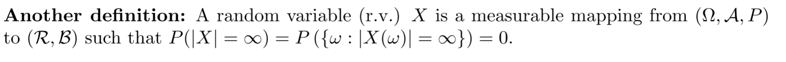
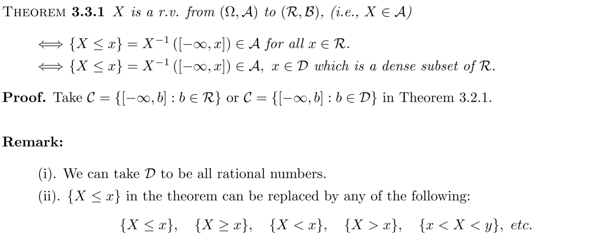
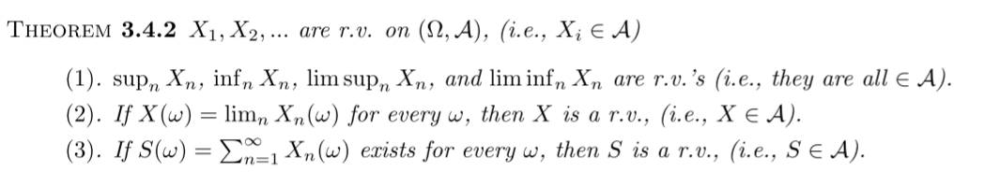
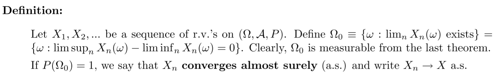

# Random Variable

## Mappings

Let $X : \Omega _{ 1 } \rightarrow \Omega_ { 2 }$ be a mapping

- $\forall B \in \Omega_2$, the **inverse image** of $B$ is

$$ X ^ { - 1 } ( B ) = \left\{ \omega : \omega \in \Omega _ { 1 } , X ( \omega ) \in B \right\} : = \{ X \in B \} $$

- $\forall\mathcal{G}\in\Omega_2,X ^ { - 1 } ( \mathcal { G } ) = \left\{ X ^ { - 1 } ( B ) : B \in \mathcal { G } \right\}$

There is some properties:

1. $X ^ { - 1 } \left( \Omega _ { 2 } \right) = \Omega _ { 1 } , X ^ { - 1 } ( \emptyset ) = \emptyset$
2. $X ^ { - 1 } \left( B ^ { c } \right) = \left[ X ^ { - 1 } ( B ) \right] ^ { c }$
3. $$ \begin{array} { l } X ^ { - 1 } \left( \cup _ { \gamma \in \Gamma } B _ { \gamma } \right) = \cup _ { \gamma \in \Gamma } X ^ { - 1 } \left( B _ { \gamma } \right) \text { for } B _ { \gamma } \subset \Omega _ { 2 } , \gamma \in \Gamma \\ X ^ { - 1 } \left( \cap _ { \gamma \in \Gamma } B _ { \gamma } \right) = \cap _ { \gamma \in \Gamma } X ^ { - 1 } \left( B _ { \gamma } \right) \text { for } B _ { \gamma } \subset \Omega _ { 2 } , \gamma \in \Gamma \end{array} $$
4. $X ^ { - 1 } \left( B _ { 1 } - B _ { 2 } \right) = X ^ { - 1 } \left( B _ { 1 } \right) - X ^ { - 1 } \left( B _ { 2 } \right) \forall B _ { 1 } , B _ { 2 } \subset \Omega _ { 2 }$
5. $B_1\sub B_2 \sub \Omega_2 \implies X^{-1}(B_1) \sub X^{-1}(B_2)$
6. If $\mathcal{B}$ is a $\sigma-$algebra, $X^{-1}(\mathcal{B})$ is also a $\sigma-$algebra.

It's easy to check $X^{-1}(\mathcal{B})$ is closed under complement and coutable union. (From properties 2 and 3)

7. If $\mathcal{C}$ is nonempty, $X ^ { - 1 } ( \sigma ( \mathcal { C } ) ) = \sigma \left( X ^ { - 1 } ( \mathcal { C } ) \right)$

## Measurable mappings

For two measurable spaces $(\Omega_1,\mathcal{A})$, $(\Omega_1,\mathcal{B})$, $X : \Omega _ { 1 } \rightarrow \Omega _ { 2 }$ is a **measurable mapping** if 
$$ X ^ { - 1 } ( B ) \equiv \{ X \in B \} \in \mathcal { A } , \quad \forall B \in \mathcal { B } $$

which is a **measurable function** if $\left( \Omega _ { 2 } , \mathcal { B } \right) = \left( \mathcal { R } ^ { n } , \mathcal { B } \left( \mathcal { R } ^ { n } \right) \right)$

Moreover, it's a **Borel function** if $\left( \Omega _ { 1 } , \mathcal { A } \right) = \left( \mathcal { R } ^ { m } , \mathcal { B } \left( \mathcal { R } ^ { m } \right) \right)$

&nbsp;

> $\forall X : (\Omega _ { 1 },\mathcal{A}) \to (\Omega _ { 2 },\mathcal{B})$ is a measurable mapping if
> $$ \forall C\in \mathcal{C} \quad s.t. \quad \mathcal{B}=\sigma(\mathcal{C}) \And X^{-1}(C)\in\mathcal{A}$$

**Proof:**
$$ X ^ { - 1 } ( \mathcal { B } ) = X ^ { - 1 } ( \sigma ( \mathcal { C } ) ) = \sigma \left( X ^ { - 1 } ( \mathcal { C } ) \right) \subset \sigma ( \mathcal { A } ) = \mathcal { A } $$

> if $X : (\Omega _ { 1 },\mathcal{A}) \to (\Omega _ { 2 },\mathcal{B})$ and $f : (\Omega _ { 2 },\mathcal{B}) \to (\Omega _ { 3 },\mathcal{C})$ are measurable mappings. then $f ( X ) = f \cdot X : \left( \Omega _ { 1 } , \mathcal { A } _ { 1 } \right) \rightarrow \left( \Omega _ { 3 } , \mathcal { A } _ { 3 } \right)$ is also measurable mappings.

## r.v

A r.v. $X$ is a measurable function from $(\Omega_1,\mathcal{A})$ to $(\mathcal{R},\mathcal{B})$. iff
$$
\{ X \in B \} = X ^ { - 1 } ( B ) \in \mathcal { A } \quad\forall B\in \mathcal{B}
$$
it denoted by

$$ X \text{ is $\mathcal{A}$-measurable} $$

or

$$ X \in \mathcal{A} $$

### Random vectors

$X=(X_1,\cdots,X_n)$ is a random vectors if $X_k$ is a r.v. $\forall k$

$X$ is a measurable function from $(\Omega,\mathcal{A})$ to $(\mathcal{R^n},\mathcal{B(R^n)})$

## Construction of random variables

$\forall X, Y$ are r.v., so are $aX+bY,X \vee Y = \max \{ X , Y \} , X \wedge Y = \min \{ X , Y \},X^2,XY,X/Y,X^+,X^-,|X|$

where $X^+=\max\{X,0\}$, $X^-=\min\{X,0\}$ and $|X|=X^++X^-$

$\forall$ random $n$ vectors $X=(X_{1:n})$ and Borel function $f$ from $\mathcal{R^n\to R^m}$, then $f(X)$ is a random $m$ vectors.

## Approximations of r.v. by simple r.v.s

### Indicator r.v.
If $A\in \mathcal{A}$, the indicator function $I_A$ is a r.v.

### Simple r.v.
If $\Omega=\sum_1^n{A_i}$, where $A_i \in \mathcal{A}$, then $X=\sum_1^n a_i I_{A_i}$ is a r.v.

Any r.v. can be approximated by simple ones:

> $\forall X \in \mathcal{A}$, $\exists 0\le X_1\le X_2 \cdots X_n$ s.t. $X _ { n } ( \omega ) \nearrow X ( \omega )$

##  $\sigma$ algebra generated by r.v.

Let $\left\{ X _ { \lambda } , \lambda \in \Lambda \right\}$ is r.v.s on $(\Omega,\mathcal{A})$. Define
$$ \sigma \left( X _ { \lambda } , \lambda \in \Lambda \right) : = \sigma \left( X _ { \lambda } \in B , B \in \mathcal { B } , \lambda \in \Lambda \right) = \sigma \left( X _ { \lambda } ^ { - 1 } ( \mathcal { B } ) , \lambda \in \Lambda \right) = \sigma \left( \cup _ { \lambda \in \Lambda } X _ { \lambda } ^ { - 1 } ( \mathcal { B } ) \right) $$
which is called  $\sigma$ algebra generated by $\left\{ X _ { \lambda } , \lambda \in \Lambda \right\}$

We have:
1. $$ \begin{aligned} \sigma \left( X _ { i } \right) & = \sigma \left( X _ { i } ^ { - 1 } ( \mathcal { B } ) \right) = X _ { i } ^ { - 1 } ( \mathcal { B } ) = \left\{ X _ { i } \in \mathcal { B } \right\} \\ \sigma \left( X _ { 1 } , \ldots , X _ { n } \right) & = \sigma \left( \cup _ { i = 1 } ^ { n } X _ { i } ^ { - 1 } ( \mathcal { B } ) \right) = \sigma \left( \cup _ { i = 1 } ^ { n } \sigma \left( X _ { i } \right) \right) \end{aligned} $$
2. $$ \begin{array} { c } \sigma \left( X _ { 1 } \right) \subset \sigma \left( X _ { 1 } , X _ { 2 } \right) \subset \ldots \ldots \subset \sigma \left( X _ { 1 } , \ldots , X _ { n } \right) \\ \sigma \left( X _ { 1 } , X _ { 2 } , \ldots . . \right) \supset \sigma \left( X _ { 2 } , X _ { 3 } , \ldots . . \right) \supset \ldots \ldots \supset \sigma \left( X _ { n } , X _ { n + 1 } , \ldots . . \right) \end{array} $$

