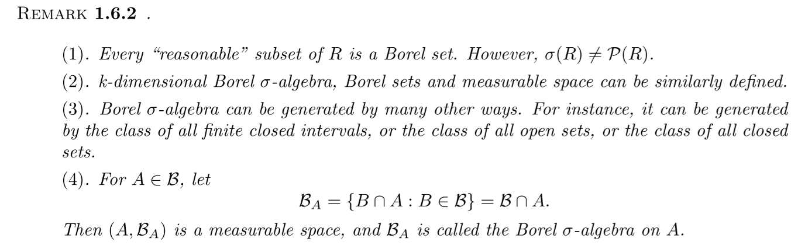
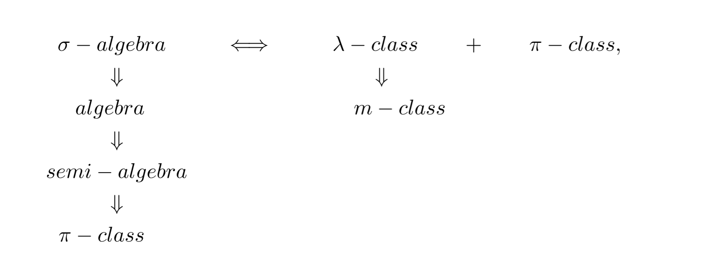

# Set Theory

$$
if:A_i \uparrow \quad 
A_n\to A=\cup _ { k = 1 } ^ { \infty } A _ { k } =\lim A_n
\\
if:A_i \downarrow \quad 
A_n\to A=\cap _ { k = 1 } ^ { \infty } A _ { k }=\lim A_n
$$

$$
\begin{array} { l } \left\{ A _ { n } , i . o . \right\} = \limsup _ { n } A _ { n } = \lim _ { k \rightarrow \infty } \cup _ { n = k } ^ { \infty } A _ { n } \\ \left\{ A _ { n } , u l t . \right\} = \liminf _ { n } A _ { n } = \lim _ { k \rightarrow \infty } \cap _ { n = k } ^ { \infty } A _ { n } \end{array}
$$
### Semi-algebra

1. $$
   A , B \in \mathcal { S } \Rightarrow A\cap B \in S
   $$

2. $$
   A\in S \Rightarrow \exist A _ { i } \in \mathcal { S } , \quad A _ { i } \cap A _ { j } = \emptyset , i \neq j,\quad s.t.  \quad A^c=\sum_{i=1}^{n}A_i
   $$

### algebra

1. $$
   A^c \in \mathcal{A} \iff A\in \mathcal{A}
   $$

2. $$
   \cup_i A_i \in \mathcal{A} \impliedby \forall i,  A_i\in\mathcal{A}
   $$

   Note that algebra is closed by finite union and we can prove that is Equivalent to it is closed by finite intersection

## $\sigma$ algebra

1.  is an algebra

2. $$
   \cup_i^\infty A_i\in \mathcal{A} \impliedby \forall i,\ A_i\in \mathcal{A}\\
   \sum_i^\infty A_i\in \mathcal{A} \impliedby \forall i,\ A_i\in \mathcal{A}
   $$

The pair $(\Omega, \mathcal{A})$ is called a **measurable space**. The sets of $\mathcal{A}$ are called **measurable sets**. 

a semi-algebra $\mathcal{S}$ can generate algebras by take all finite  disjoint unions of sets, i.e
$$
\overline { \mathcal { S } } = \{ \text {finite disjoint unions of sets in } \mathcal { S } \} = \mathcal{A} (\mathcal{S})
$$
is an algebra

Let $\left\{ \mathcal { A } _ { \gamma } : \gamma \in \Gamma \right\}$ is a collection of  $\sigma$ algebra, then we have 
$$
\mathcal { A } = \cap _ { \gamma \in \Gamma } \mathcal { A } _ { \gamma }
$$
is also  a $\sigma$ algebra.

$\forall \mathcal{A} \sub \mathcal{P}(\Omega), \quad \exist \sigma(\mathcal{A}) \quad s.t. $ 

1. $$
   \quad \mathcal{A} \sub \sigma(\mathcal{A})
   $$

2. $$
   \forall \mathcal{A} \sub\mathcal{B} \in \sigma \text{-algebras} \quad \sigma(\mathcal{A}) \sub \mathcal{B}
   $$

3.  $\sigma(\mathcal{A})$ is unique.

We have 
$$
\sigma ( \mathcal { S } ) = \sigma ( \overline { \mathcal { S } } )
$$
Which can be proved by show that
$$
\mathcal{S} \sub \sigma(\bar{\mathcal{S}}) \implies \sigma(\mathcal{\bar{S}}) \sub \sigma({\mathcal{S}})
\\
\mathcal{\bar{S}} \sub \sigma({\mathcal{S}})\implies \sigma(\mathcal{{S}}) \sub \sigma({\bar{\mathcal{S}}})
$$

The smallest $\sigma-$algebra generated by the class of all open intervals on the real line $\mathcal{R}=(-\infty,\infty)$ is **Borel $\sigma$ algebra**, denoted by $\mathcal{B}$ i.e. 
$$
\mathcal { A } = \{ ( a , b ) : - \infty < a < b < \infty \}\\
\mathcal{B}=\sigma(\mathcal{A})
$$
, whose elements are called **Borel sets​**, $(\mathcal{R},\mathcal{B})$ is called **Borel measurable space**

## $m-,\pi-,\lambda-$class 

**m-class:**

If $A_n\in\mathcal{A}$ and $A_n\uparrow or \downarrow$
$$
\lim_{n\to\infty}A_n\in \mathcal{A}
$$
**$\pi-$class** 
$$
A,B\in \mathcal{A} \implies A\cap B\in \mathcal{A}
$$
**$\lambda-$ class**

1. $$
   \Omega \in \mathcal{A}
   $$

2.  closed under proper difference:
   $$
   A-B \in \mathcal{A} \impliedby B\sub A\in \mathcal{A}
   $$

3.  is an m-class (cause $\Omega-A_i \downarrow$ whenever $A_i \uparrow$ )

m-class is equivalent to $\sigma-$ algebra when it is already an algebra:
$$
\mathcal{A} \text{ is a $\sigma-$ algebra} \implies \mathcal{A} \text{ is a $m$-class}\\
\mathcal{A} \text{ is a $\sigma-$ algebra} \impliedby \mathcal{A} \text{ is a $m$-class} \And \mathcal{A} \text{ is an algebra}\\
$$

$$
\mathcal{A} \text{ is a $\sigma-$ algebra} \iff \mathcal{A} \text{ is a $\pi-$ class} \And \mathcal{A} \text{ is a $\lambda-$ class}
$$

Which can be proved as follows:

- $\implies:$
  1. $\Omega \in \mathcal{A}$
  2. $A-B=A\cap B^c\in \mathcal{A}$
  3. is an m-class
- $\impliedby:$
  1. $A^c=\Omega-A\in \mathcal{A}$
  2. $A \cup B =(A^c \cap B^c)^c \in \mathcal{A}$
  3. hence $\mathcal{A}$ is an algebra and $\mathcal{A}$ is a m-class

Similarly, for $m,\pi,\lambda$ -class, those properties also hold:

Let $\left\{ \mathcal { A } _ { \gamma } : \gamma \in \Gamma \right\}$ is a collection of  $m,\pi,\lambda$ -class then we have 
$$
\mathcal { A } = \cap _ { \gamma \in \Gamma } \mathcal { A } _ { \gamma }
$$
is also  a $m,\pi,\lambda$ -class

$\forall \mathcal{A} \sub \mathcal{P}(\Omega), \quad \exist m(\mathcal{A}) \quad s.t. $ 

1. $$
   \quad \mathcal{A} \sub \sigma(\mathcal{A})
   $$

2. $$
   \forall \mathcal{A} \sub\mathcal{B} \in \text{m-classes} \quad m(\mathcal{A}) \sub \mathcal{B}
   $$

3. $m(\mathcal{A})$ is unique.

similarly with $\lambda(\mathcal{A})$ and $\pi(\mathcal{A})$

1. $m(\mathcal{A})=\sigma(\mathcal{A})\impliedby \mathcal{A} \text{ is already an algebra}$
2. $\lambda(\mathcal{A})=\sigma(\mathcal{A})\impliedby \mathcal{A} \text{ is already a $\pi-class$}$

Then we have **Monotone class theorem**:

$\forall \mathcal{A} \sub  \mathcal{B} \sub  \mathcal{P}(\Omega),s.t.$:

1. If $\mathcal{A}$ is a $\pi$-class, $\mathcal{B}$ is a $\lambda-$class, then $\sigma(\mathcal{A})\sub \mathcal{B}$
2. If $\mathcal{A}$ is an algebra, $\mathcal{B}$ is a $m-$class, then $\sigma(\mathcal{A})\sub \mathcal{B}$

## Product Spaces

$n$-dim **rectangles** of the product space of $\prod _ { i = 1 } ^ { n } \Omega _ { i }$
$$
\prod _ { i = 1 } ^ { n } A _ { i } : = A _ { 1 } \times \ldots \times A _ { n } = \left\{ \left( \omega _{ 1 } , \ldots , \omega_ { n } \right) : \omega _ { i } \in A _ { i } \subset \Omega _ { i } , 1 \leq i \leq n \right\}
$$
if $A_i \in \mathcal{A_i}$, they are **measurable rectangles**

the class of measurable rectangles is a $\pi$-class.

$n$-dim **product $\sigma$-algebra**:
$$
\prod _ { i = 1 } ^ { n } \mathcal { A } _ { i } = \sigma \left( \left\{ \prod _ { i = 1 } ^ { n } A _ { i } : A _ { i } \in \mathcal { A } _ { i } , 1 \leq i \leq n \right\} \right)
$$
$n$-dim product **measurable space**:
$$
\prod _ { i = 1 } ^ { n } \left( \Omega _ { i } , \mathcal { A } _ { i } \right) = \left( \prod _ { i = 1 } ^ { n } \Omega _ { i } , \prod _ { i = 1 } ^ { n } \mathcal { A } _ { i } \right)
$$
Let $\mathcal{G}$ denote the class of all measurable rectangles of $\prod _ { i = 1 } ^ { n } \Omega _ { i }$, then
$$
\mathcal{A}=\mathcal{A}(\mathcal{G})
$$
moreover,
$$
\prod _ { i = 1 } ^ { n } \mathcal { A } _ { i } =\sigma(\mathcal{A}(\mathcal{G}))
$$

## Borel

Consider all open intervel $\mathcal { C } = \left\{ [ a , b ) | a , b \in \mathbb { R } ^ { n } , a < b \right\}$, then $\sigma(\mathcal{C})$ is Borel algebra on $\Reals^n$, also denoted by $\mathcal{B(\Reals^n)}$

