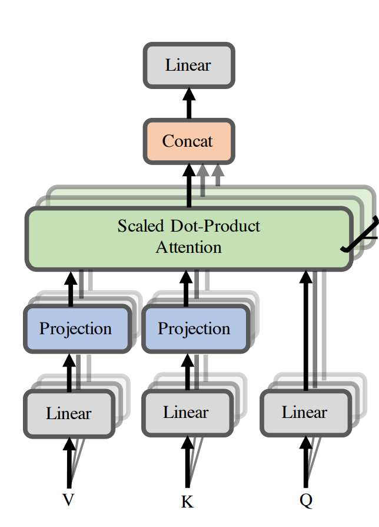

```{r, setup, include=FALSE}
knitr::opts_chunk$set(warning=FALSE,
                      message=FALSE,
                      echo=FALSE,
                      fig.width=8
                     )
# collapse = TRUE
library(ggplot2)
library(latex2exp)


# options(tinytex.engine_args = '-shell-escape')

```

# Bound of the "Losing Rank" Rate

## Structure and Path Decomposing

For one head,
$$
\text{Attention}(Q,K,V)=\text{softmax}\left( \frac{QK'}{\sqrt{d}} \right)V
$$
where $Q=W^{Q}\bm{X}$ and $K=W^{K}\bm{X}$.

```{r,,fig.align="center",fig.cap="Attention Mechanism",out.width="70%"}



```

Note that the core step of attention is the $\mathop{\text{softmax}}$ function and it has the shift invariance property, namely
$$
\mathop{\text{softmax}}\left(\bm{A}+\bm{x}\bm{1}'\right)=\mathop{\text{softmax}}(\bm{A})
$$
The property above is the basis of path decomposition theorem.

The output of SAN is given by
$$
SA_{h}(\bm{X})=\bm{P_{h}(XW_{V,h}}+\bm{eb_{V,h}'})
$$
where $\bm{P_h}\in \mathbb{R}^{n\times n}$ is being softmax, thus $\bm{P_he=e}$ and hence
$$
SA_{h}(\bm{X})=\bm{P_{h}XW_{V,h}}+\bm{eb_{V,h}'}
$$

Concat the $H$ hands, we have

$$
\begin{aligned}
    SA(\bm{X})&=
\begin{bmatrix}
    SA_1(\bm{X})	& \dots	& SA_H(\bm{X})	\\
\end{bmatrix}\begin{bmatrix}
                 W_{O,1}	\\
                 \dots\\
               W_{O,H}  	\\
             \end{bmatrix}
             \\ &= 
             \sum_{h}^{}\left( \bm{P_hXW_{V,h}W_{O,h}}+\bm{e b_{V,h}'W_{O,h}}
 \right)
\end{aligned}
$$
Let $\bm{W_h:=W_{V,h}W_{O,h}}$ and $\bm{b_{O,h}:=b_{V,h}'W_{O,h}},\bm{b_O}=\sum_{h}^{}\bm{b_{O,h}}$, then
$$
SA(\bm{X})=\sum_{h}^{}\bm{P_h XW_h}+\bm{e b_{O}'}
$$

Stack SA layer, we have
$$
\begin{aligned}
    SA \circ SA(\bm{X})&=\sum_{h}^{}\bm{P_h(\sum_{h}^{}P_hXW_h+\bm{eb'})W_h+eb'}
    \\ &= 
    \sum_{h_1,h_2}^{}\bm{P_{h_1}P_{h_2}XW_{h_1}W_{h_2}}+\bm{eb'}
\end{aligned}
$$
where $\bm{b}$ isn't the same all the time, but we omitted the script by defining new $\bm{b}$ with summation. Hence 


::: {.theorem  name="Path decomposition"}

$$
SAN(\bm{X})=\sum_{path\in [H]^{L}}^{} \bm{P_{path}XW_{path}}+\bm{eb'}
$$
where $SAN=SA_L \circ\dots\circ SA_1$($L$ layers with $H$ heads). Note if we include dummy heads, aka, skip layers, the cardinality should be $(H+1)^{L}$ instead of $H^{L}$.

:::

## Bound


::: {.definition  name=""}

-
    Composite norm of a matrix is defined as
$$
    \left\|\bm{X}\right\|_{1,\infty}=\sqrt{\left\|\bm{X}\right\|_{1}\left\|\bm{X}\right\|_{\infty}}
$$

-
    The residual of the matrix is defined as
$$
    \mathop{\text{res}}\left(\bm{X}\right)=\bm{X}-\bm{1}\bm{x}' \text{ where }\bm{x}=\argmin_{\bm{x}}\left\|\bm{X}-\bm{1}\bm{x}'\right\|_{2}
$$
:::

We want to prove that $\left\|\mathop{\text{res}}\left(\mathop{\text{SAN}}(\bm{X})\right)\right\|_{1,\infty}\to 0$ as $L\to \infty$ where $L$ is the number of layers in transformer.

::: {.theorem  name="bound of a single head single layer"}

When $\left\|\bm{W}^{l}_{QK}\right\|_{1}\left\|\bm{W}^{l}_{V}\right\|_{1,\infty}\le \beta$, we have
$$
\left\|\mathop{\text{res}}\mathop{\text{SAN}}(\bm{X})\right\|_{1,\infty}\le \left(\frac{4\beta}{\sqrt{d_{qk}}}\right)^{\frac{3^{L}-1}{2}}\left\|\mathop{\text{res}}\bm{X}\right\|_{1,\infty}^{3^{L}}
$$

:::

If the theorem of above is true, we can use path decomposition theorem to prove that the right side of this inequality $\to 0$, then we proved that the transformer structure will lead to "rank losing" of input matrix. In NLP tasks, it means that the input will be embedded into the same word vector as  $L\to \infty$.

## Complexity of Self-Attention

::: {.theorem #low name="self-attention is low rank"}

$$
\mathop{{}\mathbb{P}}\left\{ \left\| \bm{\widetilde{P}\omega'-P\omega'} \right\|\le \varepsilon \left\| \bm{P\omega'} \right\| \right\}>1-o(1)
$$
where $\mathop{\text{rank}}\left( \bm{\widetilde{P}} \right)=\Theta(\log n)$.


:::


:::: {.proof}

$$
P=\text{softmax}\left\{ \frac{A}{\sqrt{d_{qk}}} \right\}=\exp \bm{\sqrt{d_{qk}}A}\cdot \bm{D_A}^{-1}
$$

By JL lemma, we claim the approximate matrix can be $\bm{\widetilde{P}}=\bm{PR'R}$ where $\bm{R}$ is random $k\times n$ matrix with $\mathcal{N}(0,\frac{1}{k})$ entries. Then we can SVD $\widetilde{P}$ to achieve linear complexity
$$
\widetilde{P}\simeq \sum_{i=1}^{k} \sigma_i \bm{u_i v_i'}
$$


::::

```{r,,fig.align="center",fig.cap="Complexity of Transformer",out.width="70%"}


```

According to the theorem \@ref(thm:low), we can find a low rank matrix, i.e. $\mathop{\text{rank}}\tilde P=\Theta(\log n\cdot \log n)$ to replace $P$ in any self-attention layer.

It means that the low rank property of the softmax function is the reason of the losing of rank.


## Some Problem in the Papers

```{r,err1,fig.align="center",fig.cap="",out.width="70%"}


```

1.  The proof in $A.1$, shown in Figure \@ref(fig:err1).
2.  The norm in the definition of residual. If a norm does not satisfy triangle inequality, can it represent distance?
3.  Why the input residual is smaller than  $1$?
4.  The problems in conclusion part.

 


