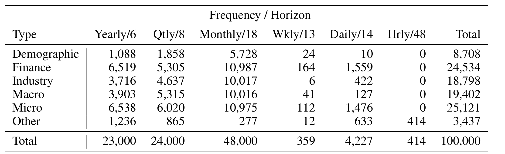
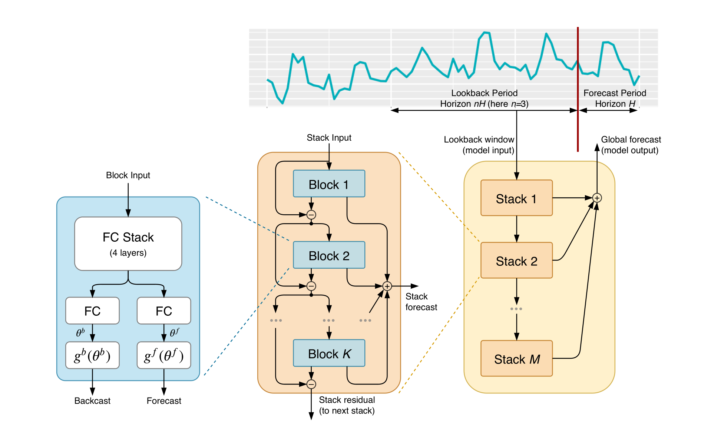
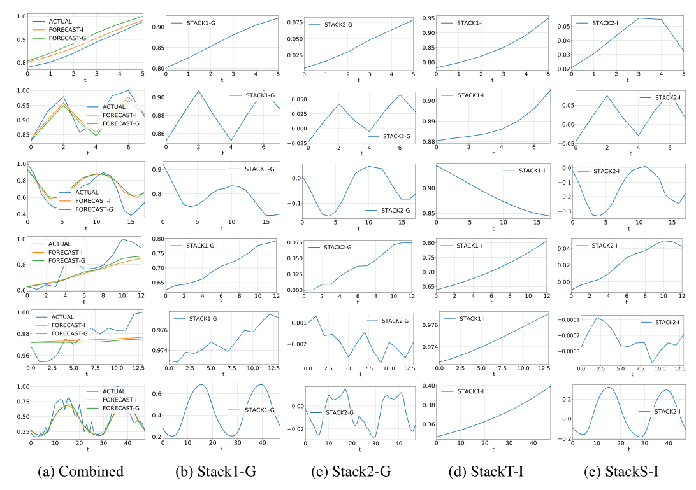
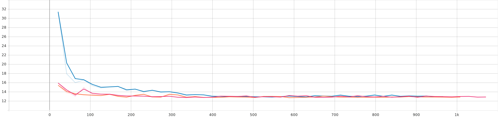
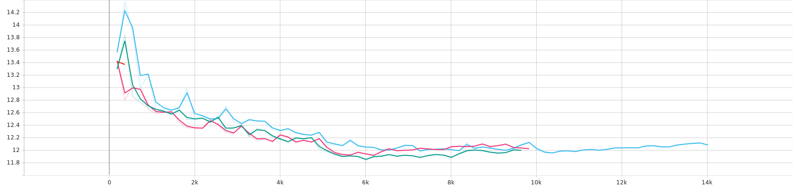
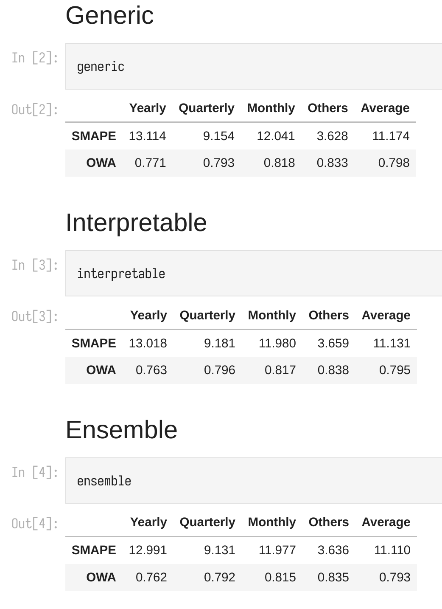

```{r setup, include=FALSE}
knitr::opts_chunk$set(warning=FALSE,
                      message=FALSE,
                      echo=FALSE, 
                      fig.width=8)
## collapse = TRUE
# dec = 'jpeg'
# eval = FALSE
# https://yihui.org/knitr/options/#chunk-options
library(reticulate)
use_python("/root/anaconda3/envs/dl/bin/python")
```


```{python, include=FALSE}
import os
os.environ["CUDA_VISIBLE_DEVICES"]="-1"
import tensorflow as tf
import keras_tuner as kt
import numpy as np
from nbeats import *
tf.config.threading.set_inter_op_parallelism_threads(8)
```


# M4 competition


M4 dataset contains $100,000$ large and diverse univariate time series.

```{r m4data, fig.align = "center", fig.cap="M4 Dataset", out.width = '70%'}



```

```{python,echo=TRUE}
freq="Yearly"
filename_train = Path(".")/f'data/Dataset/Train/{freq}-train.csv'
df=pd.read_csv(filename_train).drop('V1',axis=1)
df
```

The M4 winner is a hybrid method that mix es formula and RNN, known as **ESRNN**, therefore the M4 organizers conclude:

>"... The above findings confirm   
>
>• The poor performances of pure statistical and ML 
methods; 
>
>• The superior accomplishment of the hybrid approach"
 
NBeats trying to prove purl DL is enougth for TS: 

> "...contrarily to received wisdom, deep learning primitives such as residual blocks are by themselves sufficient to solve a wide range of forecasting problems. "


# NBeats architecture

## Architecture overview

The model is fed with a backcast period $\bm{x}\in \mathbb{R}^{back horizon}$ and predict a forecast period $\bm{y}\in \mathbb{R}^{horizon}$ (also called back horizon and horizon). The recommended equation between back horizon and horizon is:
$$
\begin{aligned}
    backhorizon&=lookback\times horizon \\
    lookback &\in  \left\{ 1,2,3,4,5,6,7 \right\}
\end{aligned}
$$

```{r nbearts-arch, fig.align = "center", fig.cap="Nbeats Architecture", out.width = '70%'}



```


## Doubly residual

$$
x_{i}:=x_{i-1}-\hat{x}_{i-1},\hat{y}=\sum_{}^{}\hat{y}_{i}
$$

As $\hat{y}_{i}=b_i(x_i)=b_i(x_{i-1}-\hat{x}_{i-1})$, we may thought each block forecast $\hat{y}_{i}$ with only $\hat{x}_{i}$, thus we further forecast $\hat{y}_{i+1}$ with the remaining part $x_i-\hat{x}_{i}$.


## Basic idea

Consider the $s$th Stock's $l$th block's theta, denote it as $\theta_{s,l}^{f}$ and $\theta_{s,l}^{b}$, where we omit batchsize dimension for simplicity, thus $\theta$ is a vector with length $\mathop{\text{dim}} \theta$. 

The idea is we generate our output as linearly combination from coefficients $\bm{\theta}$ and basis $\left\{ \bm{v_i} \right\}_{i}^{\mathop{\text{dim}} \bm{\theta}}$:
$$
\widehat{y}_{s,l}=\sum_{i=0}^{\mathop{\text{dim}} \bm{\theta}  ^{f}}   {\bm{\theta}_{s,l,i}^f\times \bm{v}^i}=\bm{V \theta}
$$
Every basis is in $\mathbb{R}^{H}$ and $\bm{V}\in \mathbb{R}^{H\times \mathop{\text{dim}} \bm{\theta}}$.

The interpretability comes from how we choose the basis vectors $\bm{V}$, if we simply choose them as random weight matrix:
$$
\hat{y}=\bm{W\theta}
$$
by a FC layer, $\hat{y}$ not being interpretable and thus known as generic model.


### Trend Model

To reflect trend, we select $\bm{v}_{i}$ as polynomial ${ \bm{t}^{i}=(0,\frac{1}{H},\dots,\frac{H-1}{H})' }^{i}$:
$$
\widehat{y}_{s,l}=\sum_{i=0}^{p}   {\bm{\theta}_{s,l,i}^f\times \bm{t}^i}=
\bm{T\theta_{s,l}^f}
$$
$$
\bm{T} = \begin{bmatrix}
        f_0	&
        f_1 &
        \cdots &
        f_{p}
    \end{bmatrix}
\circ  \begin{bmatrix}
            0\\
            \frac{1}{H}\\
        \vdots \\
            \frac{H-1}{H} 	
       \end{bmatrix}  =
\begin{pmatrix}
\left( \frac{0}{H} \right)^{0}      &       \cdots     & \left( \frac{0}{H} \right)^{p}      \\
\left( \frac{1}{H} \right)^{0}&  \cdots & \left( \frac{1}{H} \right)^{p}\\
\vdots    & \ddots & \vdots  \\
\left( \frac{H-1}{H} \right)^{0}&  \cdots & \left( \frac{H-1}{H} \right)^{p}\\
\end{pmatrix}=\mathbb{R}^{H\times (p+1)}
$$
where $f_{i}=x \mapsto x^{i}$.

### Seasonality model

In the same way as the trend we constrain $g^f$ and $g^b$. A natural choice for the basis to model periodic function is the Fourier series:

$$
\widehat{y}_{s,l}
=\sum_{i=0}^{fourier\ order}{\theta_{s,l,i}^{f}\times \cos{2\pi i \bm{t}}+\theta_{s,l,i+H/2}^{f}\times \sin{2\pi i \bm{t}}}
$$


$$
\bm{S}=
\left( c,s
\right)
\circ  \begin{bmatrix}
     0\\
     \frac{1}{H}\\
 \vdots \\
     \frac{H-1}{H} 	
\end{bmatrix} \in \mathbb{R}^{H\times 2 \left\lfloor \frac{H}{2} \right\rfloor}
$$
where
$$
\begin{aligned}
    c&=\underbrace{\cos 2\pi \cdot 0 \cdot x,\cos 2\pi \cdot 1 \cdot x,\dots, \cos 2\pi \cdot \left\lfloor \frac{H}{2}-1 \right\rfloor \cdot x}_{\text{length } \left\lfloor \frac{H}{2} \right\rfloor}\\
    s&=\underbrace{\sin 2\pi \cdot 0 \cdot x,\sin 2\pi \cdot 1 \cdot x,\dots, \sin 2\pi \cdot \left\lfloor \frac{H}{2}-1 \right\rfloor \cdot x}_{\text{length } \left\lfloor \frac{H}{2} \right\rfloor}
\end{aligned}
$$

## Interpretable output

```{r int-out, fig.align = "center", fig.cap="Outputs of Nbeats-G and Nbeats-I and thier sub-stocks", out.width = '70%'}



```

We can see Nbeats-I do capture the trend and seasonality from origin series.

# Discussion

## No future engineering

Generic N-BEATS model uses as little prior knowledge as possible, with no feature engineering, no scaling and no internal architectural components that may be considered TS-specific. 

```{python,echo=TRUE}
info_df=pd.read_csv(Path('.')/f'data/Dataset/M4-info.csv')
info_df
```

## Meta learning

- Models for different horizons and datasets reuse the same architecture. 
- If every time series is interpreted as a separate task, this can be linked back to the multitask learning and furthermore to meta-learning.
- The performance of Nbeats may benefit from it's architecture parallel to meta-learning.

## Overfitting

The training dataset is constructed by a hyperparameter $l_{h}$, the smaller $l_{h}$ is, the fewer data we use for training. Author suggest take it a small value in a relative large dataset.

Randomly choose one from last $l_{h}\cdot H$ elements, say, $x_{cutpoint}$,
$$
x_1,x_2,x_3,\dots,
\underbrace{x_{n-l_{h}H+1} ,x_{n-l_{h}H+2}
,\dots,x_{n-1},x_n}_{l_{h}\cdot horizon} 
$$
Then take the following $horizon-1$ elements and itself as label and the preceding $backhorizon$ elements as input, any exceeding part will be padding with $0$.

$$
\overbrace{{ \color{blue} {x_{cutpoint-bH},\dots,x_{cutpoint-1}} }  }^{back horizon},
\overbrace{{ \color{green} {x_{cutpoint}} } { \color{red} {,\dots,x_{cutpoint+H-1}} }  }^{horizon}
$$


```{python,echo=TRUE}
l_h=1.5
horizon=6
back_horizon=2*horizon
sampled_timeseries = np.random.uniform(0,1,(100,))
window_sampling_limit=l_h*horizon
cut_point=np.random.randint(low=max(1, len(sampled_timeseries) - window_sampling_limit),high=len(sampled_timeseries))
cut_point
```


```{python,echo=TRUE}
input = np.zeros((back_horizon),dtype=np.float32)
output = np.zeros((horizon),dtype=np.float32)
insample_window = sampled_timeseries[max(0, cut_point - back_horizon):cut_point]
outsample_window = sampled_timeseries[cut_point:min(len(sampled_timeseries), cut_point + horizon)]
input[-len(insample_window):]=insample_window
output[:len(outsample_window)]=outsample_window
print(input,input.shape)
print(output,output.shape)
```

That implicit Nbeats can be training with few data and inspire  us training on a small dataset.

We trained Nbeats by split dataset with $validation-size=0.9$, which means only $0.1$ dataset were used for training, and yet have comparable performance in test set with full dataset.

```{r small-ds, fig.align = "center", fig.cap="Validation loss vs training steps with validation_size=0.9", out.width = '70%'}



```

```{r large-ds, fig.align = "center", fig.cap="Validation loss vs training steps with validation_size=0.1", out.width = '70%'}



```

And their results in test set is:

```{python,echo=TRUE}
results_in_large_dataset()
results_in_small_dataset()
```

We may conclude that:

- Nbeats can be trained with a small dataset.
- Nbeats's performance converge rapidly.

That may indicate overfitting is a general problem in TS field.


# My reproduction

Ensemble is ensemble from generic and interpretable, each contains $180(=3\times 6\times 10 )$ sub models from
$$
loss\in \left\{ mase,mape,smape \right\},lookback\in \left\{ 2,3,4,5,6,7 \right\}
$$
and repeat $10$ times for each choice of loss and lookback.

```{r author-result, fig.align = "left", fig.cap="Author's result", out.width = '50%'}



```


```{python,echo=TRUE}
results()
```

Each of my model is trained until the loss on a random split validation dataset from train dataset stop decreasing.
